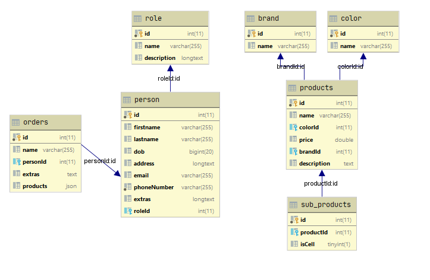

# manage-user

#### Table of contents
* [Run file script](#general-info)
* [Technologies](#technologies)
* [Setup](#setup)
* [Model Database](#model-database)

##Run file script 
RUN file SQL in folder sql
RUN manage-user.sql to create table and Data

##Technologies
All project use:
```
LIB: Vertx
Languages: Java 1.8
Database use: MYSQL
```
##Setup
Config SQL at UracTask.java

```public JDBCClient getSqlClient() {
        if (mSQLClient == null) {
            JsonObject mSQLClientConfig = new JsonObject()
                    .put("url", "jdbc:mysql://localhost:3306/manageUser")
                    .put("driver_class", "com.mysql.jdbc.Driver")
                    .put("user", "root")
                    .put("password", "root")
                    .put("max_pool_size", 30);
            mSQLClient = JDBCClient.createShared(getVertx(), mSQLClientConfig);
            log.info("Get MySQL client!");
        }
        return mSQLClient;
    }
```   
RUN
RUN project via IDE

##Model Database


